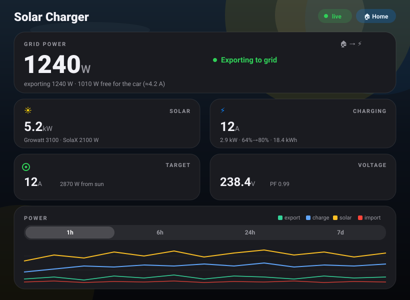

# ☀️ Solar-Aware Tesla Charger

A self-hosted Node.js service that reads your home energy meters and solar inverters in
real time and automatically tunes your **Tesla's charging amperage** to soak up your
**solar export surplus** — always keeping a configurable export buffer so you're never
paying the grid to charge the car. It ships with a mobile-first, iOS-styled dashboard
(usable from your phone over the LAN), live Server-Sent-Events updates, SQLite history,
push notifications, scheduled overnight grid charging, and a small REST API that also
drives Apple Shortcuts.

> **Local-first & private.** All credentials live in a gitignored `.env`. The dashboard
> and API have **no authentication** — run them on your LAN only.

## Screenshots



---

## Table of contents

- [What it does](#what-it-does)
- [Architecture](#architecture)
  - [The two loops](#the-two-loops)
  - [The surplus → amps math](#the-surplus--amps-math)
- [Integrations](#integrations)
  - [Tesla backends (data + commands)](#tesla-backends-data--commands)
- [Charging behavior & features](#charging-behavior--features)
- [Setup & running](#setup--running)
- [Configuration reference](#configuration-reference)
  - [`config.json` — `control` block](#configjson--control-block)
  - [`config.json` — other blocks](#configjson--other-blocks)
  - [Environment variables (`.env`)](#environment-variables-env)
- [HTTP API reference](#http-api-reference)
- [Dashboard tour](#dashboard-tour)
- [Data & persistence](#data--persistence)
- [Apple Shortcuts](#apple-shortcuts)
- [Running always-on](#running-always-on)
- [Security notes](#security-notes)
- [Project layout](#project-layout)

---

## What it does

The car's charging draw is already measured by the main grid meter, so the controller can
work out how much power it could push into the car while still keeping a small amount
flowing out to the grid (the **export buffer**). It translates that surplus into a target
**amperage** and issues Tesla commands to match — ramping the car up when the sun is strong
and down (or pausing it) when it fades. On top of solar-following **Auto** mode you get a
sticky manual **Override**, an overnight **scheduled grid charge**, a reliable **Stop**, and
live charging telemetry from a Tesla Wall Connector.

Highlights:

- **Solar-surplus charging** — derives amps from live grid export and ramps the car
  up/down, keeping the export buffer (default 500 W).
- **Voltage-aware** — uses the real charging voltage (handles local voltage sag/swell) and
  detects Tesla's voltage-drop current throttle.
- **Sticky live-adjust Override** — force a fixed rate that you can re-tune live by dragging
  the slider (no re-press), applied immediately.
- **Scheduled overnight grid charge** — charge from the grid at a fixed rate in a chosen
  time window, then return to solar-auto.
- **ETA tiles** — "To `<limit>`%" and "Done by `<clock>`" estimated from the Tesla API.
- **Solar-vs-override warning** — dashboard banner + a debounced push notification when an
  override is charging slower than the available solar surplus could.
- **Real-time dashboard** — Server-Sent Events push live updates (~2 s); interactive power
  chart with hover tooltip and 1h/6h/24h/7d ranges.
- **Push notifications** — charging start/stop and the solar warning via ntfy, Pushover, or
  Telegram.
- **Statistics** (SQLite) — energy charged, % from solar, peak power/amps, charging time,
  solar generated, exported/imported, estimated home usage; Session / Today / All-time.

---

## Architecture

A single **Express** server (`server/index.js`) serves the static dashboard, exposes the
REST API and an SSE stream, and starts the control engine in `server/controller.js`. There
is **no build step** — the front-end is plain HTML/JS using the Tailwind CDN.

**Stack:** Node.js ≥ 18 (built-in `node:sqlite`, native `fetch`), Express 4, `undici`,
`dotenv`. ES modules (`"type": "module"`).

### The two loops

`controller.js` runs two independent timers (plus a gentle car-telemetry timer):

| Loop | Interval (config key) | Reads | Writes | Purpose |
|------|-----------------------|-------|--------|---------|
| **Live loop** | `livePollSec` (~2 s) | Shelly EM meters + Wall Connector vitals; cached SolaX + weather | — | Recomputes surplus/target from the last known car state, updates `state`, emits an `update` event over SSE. **No Tesla calls.** |
| **Control loop** | `pollIntervalSec` (~10 s) | the cached car state + last meter reading | Tesla `charge_start` / `charge_stop` / `set_charging_amps` | Makes the charging decision, issues commands, and writes one sample row to SQLite. |
| **Car loop** | `carPollSec` (~90 s) | Tesla vehicle data (SoC, temps, limits, location, time-to-full) | — | Gentle telemetry refresh so the app doesn't poll/wake the car every control tick. On the Fleet backends it skips the read when the Wall Connector reports the car unplugged. |

The live charging signal (amps / voltage / charging / plugged-in) is taken from the **Wall
Connector** when available, since it's fast and cloud-independent. The car loop only
supplies slower telemetry (battery %, limits, ETA, location).

The control loop is **guarded** (`controlBusy`) so the periodic interval and on-demand
"kicks" never overlap and double-fire Tesla commands. UI actions that should take effect
immediately (override, mode, ceiling, schedule changes) call `kickControl()` to run an
out-of-band control cycle right away instead of waiting for the next tick.

### The surplus → amps math

Single-phase, with the voltage read live. Because the car's draw is already inside the grid
meter reading, the controller adds the current charge power back in to find the total it
could feed the car while keeping the buffer:

```
exportW   = max(0, -gridPower)                       # power currently flowing to the grid
chargeW   = Wall-Connector power (or estimated from the car)
surplusW  = exportW + (isCharging ? chargeW : 0) − bufferWatts
ampCeiling= min(maxAmps, car charge_current_request_max, user maxAmps slider)
targetAmps= clamp( floor(surplusW / voltage), minAmps, ampCeiling )
```

- **Voltage** is chosen from the best live source: Wall Connector while charging → car
  charger voltage → grid meter voltage → `control.voltage` fallback.
- **Start/resume threshold:** charging only starts/resumes once `surplusW ≥ minAmps ×
  voltage − resumeMarginWatts`. When `stopWhenInsufficient` is on and the surplus drops
  below that, Auto pauses charging and resumes when the sun returns.
- **Throttle detection:** if the car is pulling materially fewer amps than commanded **and**
  the charging voltage is actually sagging (below `throttleVoltage`, default 217 V), it's
  flagged as a genuine voltage-drop throttle (shown on the dashboard).
- A minimum step (`minAmpStepChange`) avoids re-commanding the car for trivial 1 A changes,
  except when a forced rate (override/schedule) is active.

---

## Integrations

Each source is optional and degrades gracefully — only the **grid** Shelly reading is
mandatory (the app throws if it can't read it).

| Source | Transport | Enable via | Used for |
|--------|-----------|-----------|----------|
| **Shelly EM (Gen1) ×2** | local HTTP `GET http://<ip>/status` | `config.json` → `shelly.devices` | grid import/export, per-circuit power/voltage/PF, voltage reference |
| **Tesla Wall Connector (Gen 3)** | local HTTP `GET http://<ip>/api/1/vitals` | `config.json` → `wallconnector.enabled` + `ip` | live charging amps/voltage/state/session kWh, handle/PCB temps |
| **Tesla (car data + commands)** | TeslaMateApi LAN HTTP **or** Fleet API | `config.json` → `tesla.backend` (+ `.env`) | set amps, start/stop, SoC, limits, ETA, temps, location |
| **SolaX inverter** | SolaX Cloud API (cached, rate-limit friendly) | `config.json` → `solax.enabled` + `.env` token | second solar array AC generation |
| **Growatt inverter** | read via a Shelly clamp channel | `config.json` → `shelly` channel with `role: "solar"` | first solar array generation |
| **Weather** | Open-Meteo (free, no key) | `config.json` → `weather.enabled` | cloud cover / radiation context at the car's location |

### Tesla backends (data + commands)

There are **three** command paths, selectable independently for *reads* and *writes*. The
read backend is set by `tesla.backend` / `TESLA_BACKEND`; the write (command) backend
defaults to the same value but can be overridden with `tesla.commandBackend` /
`TESLA_COMMAND_BACKEND`.

| Backend value | Reads (`getVehicleData`) | Commands (`set_charging_amps`, `charge_start/stop`) | What you need |
|---------------|--------------------------|------------------------------------------------------|---------------|
| `teslamateapi` *(default)* | TeslaMateApi `/status` over LAN HTTP | TeslaMateApi `/command/*` | A running [TeslaMateApi](https://github.com/tobiasehlert/teslamateapi) with `ENABLE_COMMANDS=true` and `COMMANDS_CHARGING=true`. Reuses TeslaMate's stored tokens & command host — no Tesla tokens needed here. |
| `proxy` | Fleet API `vehicle_data` (OAuth token) | **signed** vehicle commands via a local `tesla-http-proxy` (`TESLA_PROXY_BASE_URL`) | A Tesla developer app, OAuth (`/api/tesla/login`), and a running `tesla-http-proxy` for the Vehicle Command Protocol. |
| `fleet` | *(only valid as a command backend)* | direct Fleet API commands (OAuth token, app key already paired to the vehicle — no local signing proxy) | A Tesla developer app + OAuth, with the public key already paired to the car. |

Reads use the `proxy` path whenever `backend === 'proxy'`, otherwise TeslaMateApi. Writes
are dispatched by `commandBackend`: `fleet` → direct Fleet API, `proxy` → signing proxy,
anything else → TeslaMateApi. A common setup is `backend: "teslamateapi"` for gentle
DB-backed reads plus `commandBackend: "proxy"` (or `"fleet"`) for signed commands.

If no backend is configured (`teslaConfigured()` is false) the app runs **monitor-only**:
the full dashboard works, but no car commands are sent.

**Benign command results.** Tesla returns `result:false` with a harmless reason for
idempotent no-ops (e.g. `charge_start` while already charging). The reasons
`is_charging`, `not_charging`, `complete`, and `already_set` are treated as success so they
don't surface as command errors.

**Fleet API OAuth.** For the `proxy`/`fleet` backends, authorize once via the
`/tesla.html` page (or `/api/tesla/login`). Tokens are stored in
`data/tesla_tokens.json` (gitignored); the access token is refreshed automatically and
rotated refresh tokens are persisted.

---

## Charging behavior & features

| Feature | Behavior | Where |
|---------|----------|-------|
| **Auto (solar-following)** | `mode: "auto"` with no override → charges between `minAmps` and the ceiling tracking the live surplus, keeping `bufferWatts` exporting. | `controller.js` `controlCycle` |
| **Export buffer** | `bufferWatts` is subtracted from the surplus before computing amps, so a margin always flows to the grid. | `control.bufferWatts` |
| **Override (sticky, live-adjust)** | The **Override** button only turns the forced-charge mode *on* at the slider's value. Once on, **dragging the slider re-tunes the rate live** — no need to press Override again. Changes apply immediately via a control-loop kick. **"Back to auto"** clears the override and returns to solar-following. | `app.js` slider `change` handler + `setOverride`/`clearOverride` |
| **Override expiry (optional)** | An override may carry `expiresInMin`; the control loop drops it once expired. Shortcuts use this; the dashboard sets a sticky (non-expiring) override. | `controller.js` |
| **Reliable Stop** | The Start/Stop button's **Stop** is sticky: it clears any override **and** sets `mode: "pause"`, so the control loop won't auto-restart the charge from solar surplus or re-honor a stale override. "Back to auto" (or the Auto mode button) resumes. | `controller.js` `manualCharge('stop')` |
| **Scheduled overnight grid charge** | A time window (`start`–`end`, wraps past midnight) that forces a fixed grid charge at a chosen amperage, **ignoring solar**. A manual override still takes precedence over the schedule. Persisted to `data/schedule.json`. | `controller.js` `setSchedule`/`isScheduleActive` |
| **Time-to-full ETA tiles** | When charging, two tiles show **"To `<limit>`%"** (e.g. `1h20m`) and **"Done by"** (an absolute clock time), derived from the Tesla API's `time_to_full_charge`. | `app.js` `renderDetail`, `fmtEta`/`fmtClock` |
| **Solar-vs-override warning** | While an override is active and charging **slower** than the surplus could sustain (by ≥ `solarFasterMarginAmps`), the dashboard shows a banner. The push notification is edge-triggered: it must persist for `solarFasterSustainSec` (ignores passing clouds) and won't repeat within `solarFasterCooldownMin`. | `controller.js` `maybeWarnSolarFaster`, `setComputed` |
| **Insufficient-solar pause** | On Auto (no override/schedule) with `stopWhenInsufficient`, charging is held off while plugged in if the surplus can't sustain `minAmps`. Surfaces as a banner and a notification. | `controller.js` |
| **Push notifications** | Charging start/stop, unplug, insufficient-solar, paused, and the solar-faster warning are pushed instantly via the configured channel (ntfy / Pushover / Telegram). A queue is also drained by Apple Shortcuts via `/api/notify/pending`. | `notify.js`, `controller.js` `recordEvent` |
| **Dry-run** | With `control.dryRun: true`, the computed amps and decisions run normally but **no commands are sent** to the car (the dashboard shows "dry-run"). | `control.dryRun` |

---

## Setup & running

**Requirements:** Node.js **≥ 18** (for built-in `node:sqlite` and `fetch`). No native
build tools needed.

```bash
npm install
cp .env.example .env      # then fill in your values (Windows: copy .env.example .env)
# edit config.json — Shelly IPs, Wall Connector IP, control limits, Tesla backend
npm start                 # production: node server/index.js
# or
npm run dev               # auto-restart on changes: node --watch server/index.js
```

By default the server listens on **`http://0.0.0.0:3000`** (`config.json` → `server.host` /
`server.port`). Open `http://<this-machine-LAN-IP>:3000` from your phone on the same Wi-Fi,
and allow inbound TCP on the port through the firewall.

> **Tip:** start with `"dryRun": true` in `config.json` to watch the computed amps without
> sending any commands to the car. Flip it to `false` once you're satisfied.

If you use a Fleet backend (`proxy`/`fleet`), open `/tesla.html` once to authorize via OAuth
before commands will work.

---

## Configuration reference

Non-secret settings live in **`config.json`**; secrets and per-host overrides live in
**`.env`** (copy from `.env.example`). Env vars take precedence over `config.json` for the
keys they cover.

### `config.json` — `control` block

| Key | Default | Meaning |
|-----|---------|---------|
| `pollIntervalSec` | `10` | Control-loop interval — how often the car decision/commands run. |
| `livePollSec` | `2` | Live-loop interval — Shelly + Wall Connector poll and SSE push cadence. |
| `carPollSec` | `90` | Gentle car-telemetry refresh interval (SoC, temps, limits, ETA). |
| `voltage` | `230` | Fallback voltage for the amp math when no live voltage is available. |
| `bufferWatts` | `500` | Export buffer kept flowing to the grid (subtracted from surplus). |
| `bufferBandLowWatts` | `300` | Reserved hysteresis band knob (present in config). |
| `bufferBandHighWatts` | `800` | Reserved hysteresis band knob (present in config). |
| `minAmps` | `5` | Minimum charging amperage; below this the car can't charge. |
| `maxAmps` | `32` | Hard upper amperage ceiling (also seeds the user "max" slider). |
| `minAmpStepChange` | `1` | Don't re-command for amp changes smaller than this (unless forced). |
| `stopWhenInsufficient` | `true` | Pause Auto charging when the surplus can't sustain `minAmps`. |
| `resumeMarginWatts` | `200` | Slack on the start/resume threshold to avoid flapping at the edge. |
| `solarFasterMarginAmps` | `2` | Min amps the surplus must beat the override by to warn "solar could charge faster". |
| `solarFasterSustainSec` | `120` | The warning condition must persist this long before notifying (ignores spikes). |
| `solarFasterCooldownMin` | `30` | Minimum minutes between solar-faster push notifications. |
| `dryRun` | `false` | Compute decisions but send **no** Tesla commands. |

> `throttleVoltage` (default 217 V) is read by the controller for throttle detection; it can
> be added to the `control` block to tune the sag threshold.

### `config.json` — other blocks

- **`server`** — `port` (`3000`), `host` (`0.0.0.0`).
- **`shelly`** — `devices[]` (each with `ip` and a `channels` map of EM index →
  `{ key, label, role }`; roles: `grid`, `load`, `load_with_solar`, `solar`) and
  `timeoutMs`. The channel keyed `grid` is mandatory.
- **`wallconnector`** — `enabled`, `ip`, `timeoutMs`.
- **`solax`** — `enabled`, `pollSec`, `timeoutMs` (token/serial come from `.env`).
- **`weather`** — `enabled`, `pollMin`, `lat`, `lon`, `timeoutMs` (falls back to these
  coordinates when the car location isn't available).
- **`notify`** — `enabled`, `channel` (`auto` / `ntfy` / `pushover` / `telegram`).
- **`tesla`** — `backend`, `commandBackend?`, `teslamateapi.{baseUrl,carId}`,
  `proxyBaseUrl`, `rejectUnauthorized`, `wakeIfAsleep`, `commandRetries`.
- **`db`** — `path` (SQLite file, default `data/energy.db`), `sampleRetentionDays`.

### Environment variables (`.env`)

All optional unless your chosen backend/feature needs them. Use placeholders — never commit
real values.

**Tesla — TeslaMateApi backend**

| Var | Purpose |
|-----|---------|
| `TESLA_BACKEND` | `teslamateapi` (default) / `proxy`. Selects the read backend. |
| `TESLA_COMMAND_BACKEND` | Optional override for *commands*: `teslamateapi` / `proxy` / `fleet`. Defaults to `TESLA_BACKEND`. |
| `TESLAMATEAPI_BASE_URL` | TeslaMateApi base URL (e.g. `http://localhost:8080`). |
| `TESLAMATEAPI_CAR_ID` | TeslaMate car id (default `1`). |
| `TESLAMATEAPI_TOKEN` | TeslaMateApi API token (omit only if it runs with `API_TOKEN_DISABLE=true`). |

**Tesla — Fleet API backend (`proxy` / `fleet`)**

| Var | Purpose |
|-----|---------|
| `TESLA_CLIENT_ID` | Tesla developer-app client id. |
| `TESLA_CLIENT_SECRET` | Tesla developer-app client secret. |
| `TESLA_VIN` | Vehicle VIN (Fleet command/data path). |
| `TESLA_REDIRECT_URI` | OAuth redirect URI; must match the app registration (default `http://localhost:3000/api/tesla/callback`). |
| `TESLA_FLEET_BASE` | Region Fleet API base (EU/NA/CN); also the default OAuth audience. |
| `TESLA_PROXY_BASE_URL` | Local `tesla-http-proxy` base for signed commands (default `https://localhost:4443`). |
| `TESLA_AUDIENCE` | OAuth audience override (defaults to `TESLA_FLEET_BASE`). |
| `TESLA_AUTHORIZE_URL` | OAuth authorize endpoint (default Tesla auth URL). |
| `TESLA_TOKEN_URL` | OAuth token endpoint (default Fleet auth URL). |
| `TESLA_SCOPES` | OAuth scopes requested. |
| `TESLA_REFRESH_TOKEN` | Optional pre-seeded refresh token (normally obtained via `/api/tesla/login`). |

**SolaX Cloud**

| Var | Purpose |
|-----|---------|
| `SOLAX_API_URL` | SolaX Cloud base (default `https://global.solaxcloud.com`). |
| `SOLAX_TOKEN_ID` | SolaX Cloud API `tokenId`. |
| `SOLAX_WIFI_SN` | SolaX Wi-Fi dongle registration number. |

**Push notifications** (pick one channel; `NOTIFY_CHANNEL` forces it, else auto-detected)

| Var | Purpose |
|-----|---------|
| `NOTIFY_CHANNEL` | `auto` (default) / `ntfy` / `pushover` / `telegram`. |
| `NTFY_TOPIC` | ntfy topic to publish to (use a long random name — it's effectively a password). |
| `NTFY_SERVER` | ntfy server (default `https://ntfy.sh`). |
| `NTFY_TOKEN` | ntfy bearer token (only if the topic is access-protected). |
| `PUSHOVER_TOKEN` / `PUSHOVER_USER` | Pushover app token + user key. |
| `TELEGRAM_BOT_TOKEN` / `TELEGRAM_CHAT_ID` | Telegram bot token + chat id. |

> The `SHELLY_CLOUD_*` vars in `.env.example` are placeholders for an optional historical
> backfill and are not consumed by the current server code.

---

## HTTP API reference

All endpoints are unauthenticated and intended for the LAN. POST bodies are JSON. Successful
POSTs return `{ "ok": true, ... }`.

| Method | Path | Body / query | Purpose |
|--------|------|--------------|---------|
| GET | `/api/state` | – | Live state snapshot (meters, car, Wall Connector, SolaX, weather, computed target, mode, override, schedule). |
| GET | `/api/stream` | – | Server-Sent Events stream; pushes a fresh snapshot every live-loop tick (~2 s). |
| GET | `/api/stats` | `?range=today\|session\|all` | Aggregated statistics (default `today`). |
| GET | `/api/series` | `?hours=N` (1–720) | Downsampled time-series for the chart. |
| POST | `/api/mode` | `{ "mode": "auto"\|"pause" }` | Switch automation mode (switching to `auto` clears any override). |
| POST | `/api/override` | `{ "amps": N, "expiresInMin"?: N }` | Set/adjust the sticky forced-charge override (amps clamped to min/max). |
| POST | `/api/override/clear` | – | Drop the override (back to solar-auto). |
| POST | `/api/schedule` | `{ "enabled", "start", "end", "amps" }` | Set the overnight grid-charge schedule (persisted). |
| POST | `/api/maxamps` | `{ "amps": N }` | Set the user auto-ceiling (the slider value when not overriding). |
| POST | `/api/charge` | `{ "action": "start"\|"stop" }` | Manual start (un-pauses) / sticky stop (clears override + pauses). |
| GET | `/api/health` | – | Liveness probe: `{ ok, ts }`. |
| GET | `/api/notify/pending` | – | **Drains** the pending charging-event queue (for Apple Shortcuts polling). |
| GET | `/api/events` | – | Recent charging events (non-draining). |
| GET | `/api/notify/test` | – | Fire a test push to verify the configured channel. |
| GET | `/api/tesla/auth-status` | – | Fleet OAuth status (`authorized`, `configured`, `obtainedAt`). |
| GET | `/api/tesla/login` | – | Redirect to Tesla's OAuth authorize page. |
| GET | `/api/tesla/callback` | `?code&state` | OAuth redirect handler; exchanges the code and stores tokens. |
| POST | `/api/tesla/exchange` | `{ "url" }` or `{ "code", "state"? }` | Manual code exchange (paste the redirected URL/code; used by `/tesla.html`). |

Static files (the dashboard) are served from `public/` (`index.html`, `tesla.html`,
`app.js`, `style.css`).

---

## Dashboard tour

- **Grid power hero** — current import/export with an **EXPORT vs BUFFER** bar showing how
  much of the buffer is met and how many amps are free for the car.
- **Metric cards** — Solar (Growatt + SolaX), Charging (live amps + battery % + ETA +
  session kWh), Target (what the controller will command, with the reason), Voltage (+ PF).
- **Power chart** — export / charge / solar / import over 1h / 6h / 24h / 7d with a hover
  tooltip; the 1h view is live via SSE.
- **House** — per-circuit power / voltage / current / power factor, plus the SolaX cloud row.
- **Controls** — Auto/Pause segmented control; the **Override** slider + **Override / Back
  to auto** buttons; the state-aware **Start / Stop charge** button; the **Overnight charge**
  schedule card.
- **Statistics** — Session / Today / All-time tiles.
- **Vehicle & charging** — cable/charger/cabin/outside temps, battery, range, and the
  **"To `<limit>`%"** / **"Done by"** ETA tiles.
- **Banner** — surfaces "Tesla not configured", errors, active override, the solar-faster
  warning, an active schedule, insufficient-solar pause, and throttle detection.

---

## Data & persistence

SQLite via Node's built-in `node:sqlite` (no native build). The DB file defaults to
`data/energy.db` (`db.path`).

- **`samples`** — one row per control cycle (grid/export/import, per-circuit, voltage,
  charging state, commanded/target amps, charge W, SolaX W, mode, action). Pruned after
  `db.sampleRetentionDays` (default 60).
- **`sessions`** — per charging session: energy (Wh) split into solar/grid, peak W/amps,
  number of adjustments.

Other runtime files in `data/` (all gitignored): `schedule.json` (persisted schedule) and
`tesla_tokens.json` (Fleet OAuth refresh token).

---

## Apple Shortcuts

The LAN HTTP endpoints drive iOS Shortcuts with a single **Get Contents of URL** action —
resume/pause automation, force a timed override, start/stop, read status, and drain charging
notifications. See [`shortcuts/README.md`](shortcuts/README.md) for ready-made recipes.

---

## Running always-on

On Windows, run it at startup via Task Scheduler ("At log on"/"At startup",
`node server\index.js`) or a service wrapper such as [NSSM](https://nssm.cc/). Give the
machine a static DHCP lease so the LAN IP (and your Shortcuts) don't break.

---

## Security notes

- `.env` (Tesla/SolaX tokens, push keys) and `data/` (the SQLite DB and OAuth tokens) are
  **gitignored** — keep them that way.
- The dashboard and REST API have **no authentication**; expose them on your LAN only. For
  remote access use a VPN/Tailscale, never a public port-forward.

---

## Project layout

```
server/
  index.js         Express app: REST API, SSE stream, OAuth routes, static dashboard, boot
  config.js        Loads config.json + .env into one merged config object
  controller.js    Live loop (~2 s) + control loop (~10 s) + car loop (~90 s); surplus → amps
  shelly.js        Polls the two Shelly EM (Gen1) meters
  wallconnector.js Reads the Tesla Wall Connector local vitals API (read-only)
  tesla.js         Car data + commands; teslamateapi / proxy / fleet backends
  teslaAuth.js     Tesla Fleet API OAuth (authorize, callback, token refresh)
  solax.js         SolaX Cloud client (cached, rate-limit friendly)
  weather.js       Open-Meteo current weather (cached)
  notify.js        Push notifications: ntfy / Pushover / Telegram
  stats.js         Aggregations for the statistics panel and charts
  db.js            SQLite (node:sqlite) sample/session storage
public/
  index.html       Mobile-first dashboard (Tailwind CDN, iOS "Liquid Glass" styling)
  app.js           Dashboard logic: SSE, rendering, chart, controls
  tesla.html       Fleet API OAuth connect/paste helper page
  style.css        Supplementary styles
config.json        Non-secret config (IPs, limits, buffers, poll intervals, Tesla backend)
.env               Secrets (gitignored) — see .env.example
shortcuts/         Apple Shortcuts recipes (README)
data/              SQLite DB, schedule.json, tesla_tokens.json (gitignored)
```
